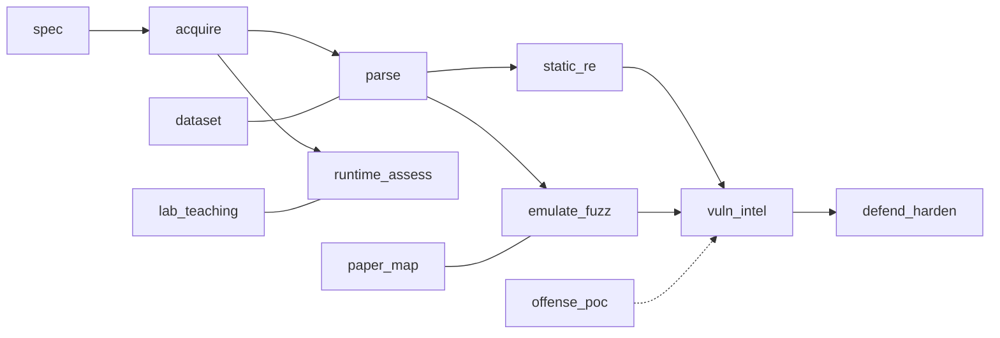

# Domain map — rtos-firmware-atlas

```mermaid
flowchart LR
  spec --> acquire --> parse
  parse --> static_re
  parse --> emulate_fuzz
  static_re --> vuln_intel
  emulate_fuzz --> vuln_intel
  acquire --> runtime_assess
  vuln_intel --> defend_harden
  offense_poc -.-> vuln_intel
  dataset --- parse
  paper_map --- emulate_fuzz
  lab_teaching --- runtime_assess
```
